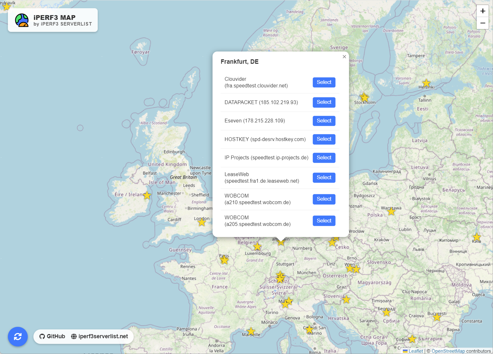
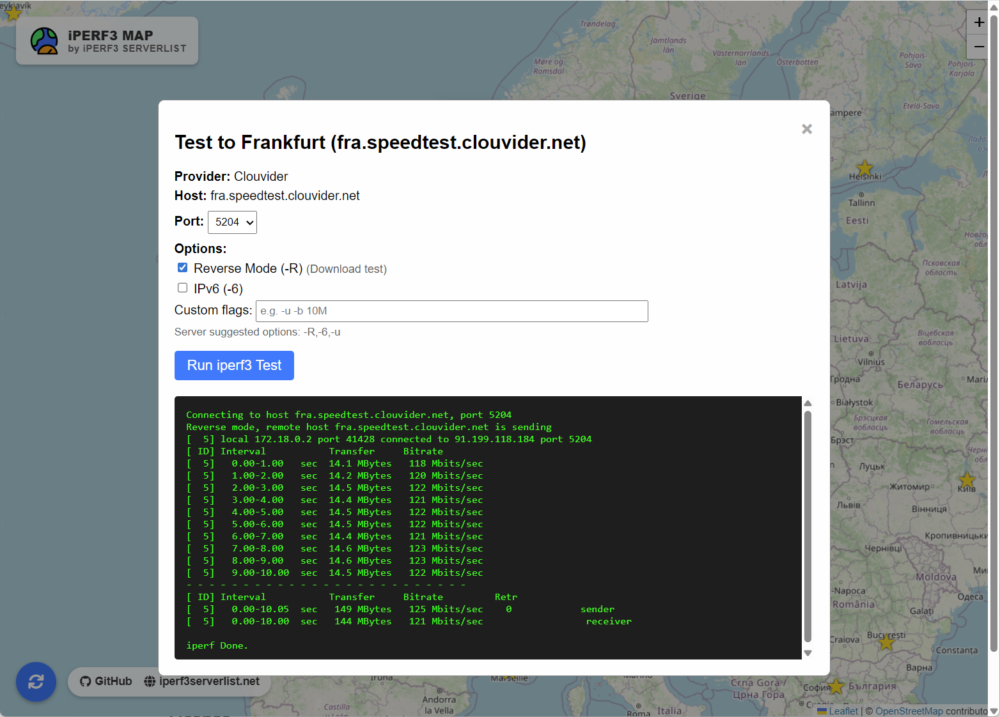

# IPERF3 MAP

This project provides a web-based interactive map interface for visualizing and testing public iPerf3 servers. It automatically fetches a list of [public iperf3 servers](https://github.com/R0GGER/public-iperf3-servers), determines their geographic locations, and allows you to run iPerf3 speed tests directly from your browser.

  


- **Interactive Map & Testing**: Visualizes iPerf3 servers on a global map using Leaflet.js, allowing you to initiate speed tests directly from the map markers.
- **Automatic Geocoding**: resolving server locations (City/Country) to coordinates using `geonamescache` (offline) and OpenStreetMap's Nominatim (online fallback).
- **Smart Caching**: Caches geocoded locations locally to improve performance and respect API rate limits.
- **Integrated Speed Tests**: Run `iperf3` commands directly from the web interface against any server on the map.

## Prerequisites

- Docker
- Docker Compose

## Installation & Usage

1. **Clone the repository:**
   ```bash
   git clone <repository-url>
   cd iperf3-map
   ```

2. **Build and run the container:**
   ```bash
   docker-compose up -d --build
   ```

3. **Access the application:**
   Open your browser and navigate to `http://localhost:5000`.

## License

[MIT License](LICENSE) 

